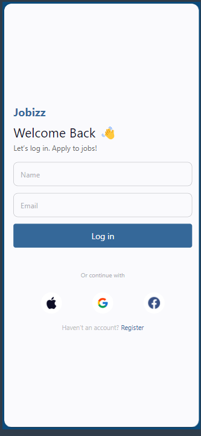

Description:
This project is a React Native application designed to replicate a job application interface with a login screen and a home screen displaying job listings. Users can log in by entering their name and email, which will then be displayed on the home screen along with featured and popular job listings.
Login Screen:
Allows users to enter their name and email.
On pressing "Log in", the user is navigated to the Home Screen with the entered details passed as parameters.
Home Screen:
Displays the user's name and email.
Provides a search bar for job searches.
Shows a list of featured and popular job cards.

Screenshots
Login Screen: 
Home Screen: 